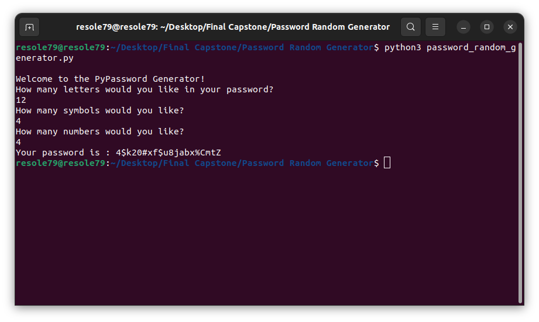

## PyPassword Generator

Program to generate a random password.   
###### It's a part of the **#100DaysOfCode** challenge by *Angela Yu*. ######    


#### Prerequisites
You will need the following software to run the PyPassword Generator:
 - [Python 3](https://www.python.org/downloads/)

#### Installation
To get started with the **PyPassword Generator**, follow these steps:

1. **Clone** the repository:

```sh
git clone https://github.com/resole79/password_random_generator.git
```

2. **Run** the **password_random_generator.py** file:

```sh
python password_random_generator.py
```

#### File Structure   
 - **password_random_generator.py**: Main program.


#### **Usage**

Ask the user to input:
 - How many letters, symbol and numbers would like in password




## **Credit**

Author : Emilio Reforgiato (resole79)

##
<p align="right"><a href="https://www.linkedin.com/in/emilio-reforgiato/" target=”_blank” ></a></p>


